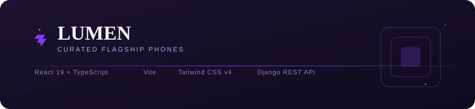
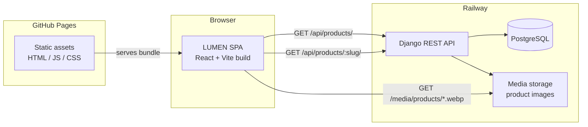
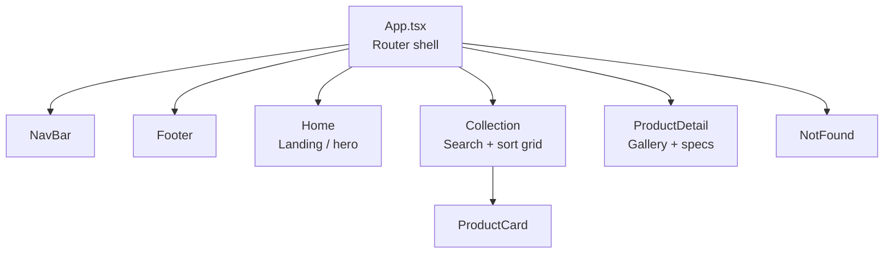
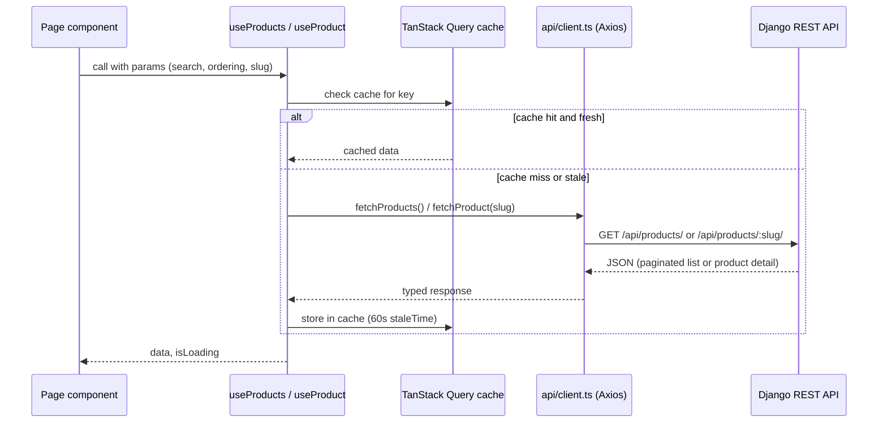
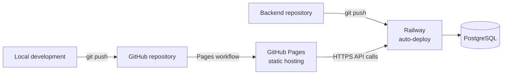

<div align="center">



<br/>


</div>

<br/>

## Overview

**LUMEN** is a single-page storefront concept for a small, curated catalog of flagship smartphones. It is a **frontend engineering sample** built to demonstrate a clean React + TypeScript architecture consuming a real REST API: typed data fetching, cache-aware querying, animated page transitions, and a restrained, editorial visual design.

The project is deployed as a static site (GitHub Pages) talking to a separate Django REST API backend (Railway). This repository contains the **frontend only**.

<br/>

## Table of contents

- [Design language](#design-language)
- [Architecture](#architecture)
- [Application structure](#application-structure)
- [Data flow](#data-flow)
- [Routes](#routes)
- [Tech stack](#tech-stack)
- [Project structure](#project-structure)
- [Deployment topology](#deployment-topology)
- [License](#license)

<br/>

## Design language

LUMEN's visual identity is quiet and editorial rather than loud e-commerce: a dark ink background, a single violet accent, monospace micro-labels, and a serif display face for headings.

<table>
<tr>
<td width="50%" valign="top">

**Color palette**

| Token | Swatch | Hex | Role |
|---|---|---|---|
| `ink` |  | `#100b1f` | Page background |
| `surface` |  | `#1b1330` | Cards / nav |
| `prism-violet` |  | `#863bff` | Primary accent |
| `deep-violet` |  | `#7e14ff` | Accent depth |
| `prism-blue` |  | `#47bfff` | Secondary highlight |
| `line` |  | `#2c2c2a` | Hairline borders |

</td>
<td width="50%" valign="top">

**Typography**

| Use | Face | Notes |
|---|---|---|
| Display / headings | Serif (`font-display`) | Editorial tone |
| Body copy | System sans | Readability |
| Labels / meta | Monospace, uppercase, tracked | Product-sheet feel |

**Motion**

Page and element transitions are handled with `framer-motion`, fade and rise on mount, scale feedback on interactive controls.

</td>
</tr>
</table>

<br/>

## Architecture

The frontend is a fully static React SPA. It never touches a database directly, every piece of catalog data (products, images, pricing, stock) is fetched from the Django REST API at runtime, over HTTPS.



<br/>

## Application structure



Each route is a thin page component that composes shared primitives (`NavBar`, `Footer`, `ProductCard`) and pulls its data through the `useProducts` / `useProduct` hooks, no page ever calls `axios` directly.

<br/>

## Data flow

Data fetching is centralized behind two TanStack Query hooks, which wrap a single typed Axios client. This keeps caching, loading, and error states consistent across every page that needs catalog data.



All response shapes are typed end to end via `src/types/catalog.ts` (`ProductListItem`, `ProductDetail`, `ProductImage`, `Paginated<T>`), so the API contract is enforced at compile time in every component that consumes it.

<br/>

## Routes

| Path | Page | Purpose |
|---|---|---|
| `/` | `Home` | Hero, brand intro, featured entry point |
| `/collection` | `Collection` | Full catalog with live search and sort |
| `/product/:slug` | `ProductDetail` | Gallery, pricing, specifications for one device |
| `*` | `NotFound` | Fallback for unmatched routes |

<br/>

## Tech stack

| Layer | Choice | Why |
|---|---|---|
| Framework | React 19 | Modern concurrent rendering, hooks-first |
| Language | TypeScript | End-to-end type safety against the API contract |
| Build tool | Vite | Fast dev server, minimal config |
| Styling | Tailwind CSS v4 | Utility-first, no runtime CSS-in-JS cost |
| Data fetching | TanStack Query + Axios | Caching, staleness, and loading states out of the box |
| Routing | React Router 7 | Client-side navigation for the SPA |
| Animation | Framer Motion | Declarative enter/exit and gesture transitions |
| Linting | oxlint | Fast, zero-config linting |

<br/>

## Project structure

```
lumen/
├── index.html
├── public/
│   └── favicon.svg
├── docs/
│   └── banner.svg
└── src/
    ├── main.tsx              # App entry point
    ├── App.tsx               # Router shell (NavBar / Routes / Footer)
    ├── index.css              # Tailwind entry + design tokens
    ├── api/
    │   └── client.ts          # Axios instance + typed request functions
    ├── hooks/
    │   └── useProducts.ts     # TanStack Query hooks
    ├── types/
    │   └── catalog.ts         # Shared API response types
    ├── lib/
    │   └── format.ts          # Formatting helpers (currency, etc.)
    ├── components/
    │   ├── NavBar.tsx
    │   ├── Footer.tsx
    │   └── ProductCard.tsx
    └── pages/
        ├── Home.tsx
        ├── Collection.tsx
        ├── ProductDetail.tsx
        └── NotFound.tsx
```

<br/>

## Deployment topology



The frontend and backend live in **separate repositories** and deploy independently:

- **Frontend**, built with Vite, published as a static bundle to **GitHub Pages**.
- **Backend**, Django REST Framework service on **Railway**, backed by PostgreSQL, serving both the API and product media.

<br/>

## License

<table>
<tr>
<td width="80%">

This repository is shared **strictly for portfolio and code-review purposes**.

All rights reserved. No license is granted to use, copy, modify, merge, publish, distribute, sublicense, or sell copies of this software, in whole or in part, for any purpose.

</td>
<td width="20%" align="center">


</td>
</tr>
</table>

<div align="center">
<sub>© LUMEN, for records only.</sub>
</div>
